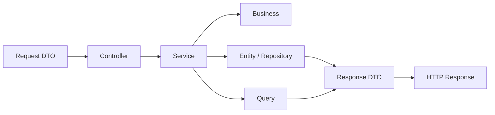

<p align="center">
  
</p>

<h1 align="center">M3L for Spring Boot</h1>

<p align="center">
  <a href="./README.md">Language Portal</a> •
  <a href="./README.pt-BR.md">Português (BR)</a>
</p>

Implementation of the **M3L — Modular in 3 Layers** pattern for **Spring Boot** backend applications.

M3L organizes the application by **business modules**, and each module is divided into **three main layers**: `Http`, `Domain`, and `Infrastructure`. Its goal is to build clearer, more cohesive, predictable, and sustainable backends by using Spring Boot with architectural discipline.

---

## Table of Contents

- [Overview](#overview)
- [Core Principle](#core-principle)
- [Base Structure](#base-structure)
- [Architectural Flow](#architectural-flow)
- [Layer Responsibilities](#layer-responsibilities)
- [Practical Example](#practical-example)
- [Cross-Module Queries](#cross-module-queries)
- [Mandatory Conventions](#mandatory-conventions)
- [Mental Checklist](#mental-checklist)
- [What Is Allowed / What Should Not Be the Default](#what-is-allowed--what-should-not-be-the-default)
- [Controlled Extensibility](#controlled-extensibility)
- [Repository Purpose](#repository-purpose)
- [License](#license)

---

## Overview

M3L is not just a way to organize packages. It defines a disciplined way to use Spring Boot without letting the framework’s convenience dilute architectural clarity.

In this pattern, the project is organized by **functional contexts**, not by global technical dumping grounds such as `controller`, `service`, `repository`, and `entity` scattered at the application root.

> The logic is simple: the module is the main organizational unit; layers exist inside it to separate responsibilities.

In the Spring Boot ecosystem, that means taking advantage of what the stack offers best — stand-alone applications, auto-configuration, starter dependencies, and persistence abstractions — without letting everything turn into one giant annotation-driven coupling. Good architecture is not the one with the most `@Something`; it is the one that still makes sense six months later.

---

## Core Principle

> **Module first, layer after.**

The M3L architectural flow can be summarized like this:

- **Controllers receive**
- **Services orchestrate**
- **Business decides**
- **Entities persist**
- **Repositories support canonical persistence**
- **Queries read and compose data**

This principle reduces coupling, improves readability, and makes it harder for the project to turn into a pile of “ownerless” classes.

---

## Base Structure

```txt
src/main/java/com/m3l/modules/
  companies/
    http/
      controllers/
      requests/
      responses/
    domain/
      services/
      business/
      enums/
    infrastructure/
      entities/
      repositories/
      queries/
```

Each module concentrates its HTTP entrypoint, orchestration, business rules, canonical persistence, and read queries.

### Quick Reading of the Structure

| Layer | Role |
|---|---|
| `http` | Application input and output |
| `domain` | Orchestration and business rules |
| `infrastructure` | Persistence and queries |

### Important Note About Materialization in Spring Boot

In Spring Boot, a module’s canonical persistence naturally materializes through **`Entity` + `Repository`**. HTTP output, in turn, is usually represented by **response DTOs**, organized in `http/responses`.

The architectural principle remains the same; only the way each responsibility materializes inside the stack changes.

---

## Architectural Flow



### Flow Summary

**Request DTO -> Controller -> Service -> Business -> Entity / Repository / Query -> Response DTO**

- **Request DTO** validates input
- **Controller** receives and delegates
- **Service** orchestrates the use case
- **Business** concentrates pure rules
- **Entity** represents persisted state
- **Repository** supports canonical aggregate persistence
- **Query** resolves reads, filters, projections, and joins
- **Response DTO** transforms HTTP output

---

## Layer Responsibilities

### Http

Responsible for application input and output.

| Element | Responsibility | Can use | Should not do |
|---|---|---|---|
| `Controllers` | Receive the request and delegate the use case | `@RestController`, `@RequestMapping`, `ResponseEntity`, dependency injection | Business rules, complex queries, direct writes through `Repository` |
| `Requests` | Validate and represent HTTP input | `record`, Bean Validation, `@Valid`, annotations such as `@NotBlank` | Business rules, persistence, heavy queries |
| `Responses` | Represent HTTP output | response DTOs, `record`, response mapping | Query the database, decide rules, mutate state |

### Domain

Responsible for orchestration and business rules.

| Element | Responsibility | Can use | Should not do |
|---|---|---|---|
| `Services` | Orchestrate the use case | `@Service`, `@Transactional`, `Business`, `Repositories`, `Queries` | Become a giant class holding all system rules |
| `Business` | Concentrate pure domain rules | Plain Java, enums, neutral objects, calculations, conceptual validations | Know `Entity`, `Repository`, `Controller`, `Query`, or another `Business` |
| `Enums` | Represent controlled states | Native Java `enum` | Spread magic strings across the system |

### Infrastructure

Responsible for persistence and queries.

| Element | Responsibility | Can use | Should not do |
|---|---|---|---|
| `Entities` | Represent the module’s canonical persistence | JPA, `@Entity`, mappings, structural constraints | Hold business flow |
| `Repositories` | Support canonical persistence and simple aggregate queries | Spring Data JPA, derived methods, aggregate persistence | Become use-case orchestrators or rule engines |
| `Queries` | Resolve reads, filters, projections, reports, and joins | `@Query`, projections, `EntityManager`, Querydsl | Transactional writes and business-rule decisions |

---

## Practical Example

### `Companies` Module Structure

```txt
src/main/java/com/m3l/modules/companies/
  http/
    controllers/
      CompanySaveController.java
    requests/
      CompanySaveRequest.java
    responses/
      CompanyResponse.java
  domain/
    services/
      CompanySaveService.java
    business/
      CompanyValidationBusiness.java
    enums/
      CompanyStatus.java
  infrastructure/
    entities/
      CompanyEntity.java
    repositories/
      CompanyRepository.java
    queries/
      CompanyListQuery.java
```

### Complete Module Example

<details>
<summary><strong>CompanySaveController.java</strong></summary>

```java
package com.m3l.modules.companies.http.controllers;

import com.m3l.modules.companies.domain.services.CompanySaveService;
import com.m3l.modules.companies.http.requests.CompanySaveRequest;
import com.m3l.modules.companies.http.responses.CompanyResponse;
import jakarta.validation.Valid;
import org.springframework.http.ResponseEntity;
import org.springframework.web.bind.annotation.PostMapping;
import org.springframework.web.bind.annotation.RequestBody;
import org.springframework.web.bind.annotation.RequestMapping;
import org.springframework.web.bind.annotation.RestController;

@RestController
@RequestMapping("/api/companies")
public class CompanySaveController {

    private final CompanySaveService service;

    public CompanySaveController(CompanySaveService service) {
        this.service = service;
    }

    @PostMapping
    public ResponseEntity<CompanyResponse> handle(@Valid @RequestBody CompanySaveRequest request) {
        var company = service.handle(request);
        return ResponseEntity.ok(CompanyResponse.from(company));
    }
}
```

</details>

<details>
<summary><strong>CompanySaveRequest.java</strong></summary>

```java
package com.m3l.modules.companies.http.requests;

import jakarta.validation.constraints.NotBlank;
import jakarta.validation.constraints.Size;

public record CompanySaveRequest(
    @NotBlank
    @Size(max = 255)
    String name,

    @NotBlank
    @Size(max = 20)
    String document,

    @NotBlank
    @Size(max = 50)
    String type
) {}
```

</details>

<details>
<summary><strong>CompanyResponse.java</strong></summary>

```java
package com.m3l.modules.companies.http.responses;

import com.m3l.modules.companies.infrastructure.entities.CompanyEntity;

import java.util.UUID;

public record CompanyResponse(
    Long id,
    UUID uuid,
    String name,
    String document,
    String type,
    String status
) {
    public static CompanyResponse from(CompanyEntity entity) {
        return new CompanyResponse(
            entity.getId(),
            entity.getUuid(),
            entity.getName(),
            entity.getDocument(),
            entity.getType(),
            entity.getStatus().name().toLowerCase()
        );
    }
}
```

</details>

<details>
<summary><strong>CompanySaveService.java</strong></summary>

```java
package com.m3l.modules.companies.domain.services;

import com.m3l.modules.companies.domain.business.CompanyValidationBusiness;
import com.m3l.modules.companies.domain.enums.CompanyStatus;
import com.m3l.modules.companies.http.requests.CompanySaveRequest;
import com.m3l.modules.companies.infrastructure.entities.CompanyEntity;
import com.m3l.modules.companies.infrastructure.repositories.CompanyRepository;
import org.springframework.stereotype.Service;
import org.springframework.transaction.annotation.Transactional;

import java.util.UUID;

@Service
public class CompanySaveService {

    private final CompanyValidationBusiness validationBusiness;
    private final CompanyRepository repository;

    public CompanySaveService(
        CompanyValidationBusiness validationBusiness,
        CompanyRepository repository
    ) {
        this.validationBusiness = validationBusiness;
        this.repository = repository;
    }

    @Transactional
    public CompanyEntity handle(CompanySaveRequest request) {
        validationBusiness.validateForSave(request.document(), request.type());

        var entity = new CompanyEntity();
        entity.setUuid(UUID.randomUUID());
        entity.setName(request.name());
        entity.setDocument(request.document());
        entity.setType(request.type());
        entity.setStatus(CompanyStatus.PENDING);

        return repository.save(entity);
    }
}
```

</details>

<details>
<summary><strong>CompanyValidationBusiness.java</strong></summary>

```java
package com.m3l.modules.companies.domain.business;

import java.util.Set;

public class CompanyValidationBusiness {

    private static final Set<String> ALLOWED_TYPES = Set.of(
        "generator",
        "operator",
        "manager",
        "manufacturer"
    );

    public void validateForSave(String document, String type) {
        if (document == null || document.isBlank()) {
            throw new IllegalArgumentException("Company document is required.");
        }

        if (!ALLOWED_TYPES.contains(type)) {
            throw new IllegalArgumentException("Invalid company type.");
        }
    }
}
```

</details>

<details>
<summary><strong>CompanyStatus.java</strong></summary>

```java
package com.m3l.modules.companies.domain.enums;

public enum CompanyStatus {
    PENDING,
    APPROVED,
    REJECTED
}
```

</details>

<details>
<summary><strong>CompanyEntity.java</strong></summary>

```java
package com.m3l.modules.companies.infrastructure.entities;

import com.m3l.modules.companies.domain.enums.CompanyStatus;
import jakarta.persistence.Column;
import jakarta.persistence.Entity;
import jakarta.persistence.EnumType;
import jakarta.persistence.Enumerated;
import jakarta.persistence.GeneratedValue;
import jakarta.persistence.GenerationType;
import jakarta.persistence.Id;
import jakarta.persistence.Table;
import lombok.Getter;
import lombok.NoArgsConstructor;
import lombok.Setter;

import java.util.UUID;

@Getter
@Setter
@NoArgsConstructor
@Entity
@Table(name = "companies")
public class CompanyEntity {

    @Id
    @GeneratedValue(strategy = GenerationType.IDENTITY)
    private Long id;

    @Column(nullable = false, unique = true)
    private UUID uuid;

    @Column(nullable = false, length = 255)
    private String name;

    @Column(nullable = false, length = 20)
    private String document;

    @Column(nullable = false, length = 50)
    private String type;

    @Enumerated(EnumType.STRING)
    @Column(nullable = false, length = 20)
    private CompanyStatus status;
}
```

</details>

<details>
<summary><strong>CompanyRepository.java</strong></summary>

```java
package com.m3l.modules.companies.infrastructure.repositories;

import com.m3l.modules.companies.infrastructure.entities.CompanyEntity;
import org.springframework.data.jpa.repository.JpaRepository;

public interface CompanyRepository extends JpaRepository<CompanyEntity, Long> {
    boolean existsByDocumentAndType(String document, String type);
}
```

</details>

<details>
<summary><strong>CompanyListQuery.java</strong></summary>

```java
package com.m3l.modules.companies.infrastructure.queries;

import com.m3l.modules.companies.domain.enums.CompanyStatus;
import com.m3l.modules.companies.infrastructure.entities.CompanyEntity;
import org.springframework.data.jpa.repository.Query;
import org.springframework.data.repository.Repository;
import org.springframework.data.repository.query.Param;

import java.util.List;
import java.util.UUID;

public interface CompanyListQuery extends Repository<CompanyEntity, Long> {

    @Query("""
        select new com.m3l.modules.companies.infrastructure.queries.CompanyListQuery.CompanyListItem(
            c.id,
            c.uuid,
            c.name,
            c.document,
            c.type,
            c.status
        )
        from CompanyEntity c
        where (:status is null or c.status = :status)
          and (:name is null or lower(c.name) like lower(concat('%', :name, '%')))
        order by c.name
    """)
    List<CompanyListItem> handle(
        @Param("status") CompanyStatus status,
        @Param("name") String name
    );

    record CompanyListItem(
        Long id,
        UUID uuid,
        String name,
        String document,
        String type,
        CompanyStatus status
    ) {}
}
```

</details>

## Cross-Module Queries

In M3L, cross-module reads should be resolved through **`Queries`**, not through structural coupling via indiscriminate navigation of entities as the main strategy. The `Entity` still belongs to the owning module; the join belongs to the `Query`.

Example:

```java
package com.m3l.modules.documents.infrastructure.queries;

import org.springframework.jdbc.core.namedparam.NamedParameterJdbcTemplate;
import org.springframework.stereotype.Repository;

import java.util.List;
import java.util.Map;

@Repository
public class DocumentWithCompanyListQuery {

    private final NamedParameterJdbcTemplate jdbc;

    public DocumentWithCompanyListQuery(NamedParameterJdbcTemplate jdbc) {
        this.jdbc = jdbc;
    }

    public List<DocumentWithCompanyItem> handle(String status) {
        var sql = """
            select
                d.id,
                d.uuid,
                d.type,
                d.number,
                d.status,
                c.id   as company_id,
                c.name as company_name
            from documents d
            join companies c on c.id = d.company_id
            where (:status is null or d.status = :status)
            order by d.id desc
        """;

        return jdbc.query(sql, Map.of("status", status), (rs, rowNum) -> new DocumentWithCompanyItem(
            rs.getLong("id"),
            rs.getString("uuid"),
            rs.getString("type"),
            rs.getString("number"),
            rs.getString("status"),
            rs.getLong("company_id"),
            rs.getString("company_name")
        ));
    }

    public record DocumentWithCompanyItem(
        Long id,
        String uuid,
        String type,
        String number,
        String status,
        Long companyId,
        String companyName
    ) {}
}
```

---

## Mandatory Conventions

- **Controllers**: action-oriented
- **Services**: a single public method called `handle()`
- **Business**: does not know `Entity`, `Repository`, `Query`, or another `Business`
- **Entities**: canonical entity of the owning module
- **Repositories**: canonical persistence and simple aggregate queries
- **Queries**: reads, filters, projections, reports, and joins

---

## Mental Checklist

- Is this HTTP input? It goes in `http`
- Does this orchestrate a use case? It goes in `domain/services`
- Is this a pure rule? It goes in `domain/business`
- Does this represent a controlled state? It goes in `domain/enums`
- Is this canonical persistence of the module? It goes in `infrastructure/entities` and `infrastructure/repositories`
- Is this a read, filter, projection, report, or join? It goes in `infrastructure/queries`

---

## What Is Allowed / What Should Not Be the Default

### Allowed

- Service calling Business, using Repository, and opening a transaction
- Request DTO validating payload format and required fields
- Response DTO transforming HTTP output
- Query performing filters, projections, reports, and joins
- Enum representing status, type, and category

### Should Not Be the Default

- Controller using Repository directly or concentrating business rules
- Business accessing the database, knowing Query, or another Business
- Entity turning into an object with application flow logic
- Repository turning into a use-case orchestration hub
- Navigation between entities from different modules becoming the main architectural strategy
- Service turning into a giant file with everything inside it

---

## Controlled Extensibility

M3L allows additional subdirectories inside layers when there is a real and justifiable technical need, such as:

- `mappers`
- `factories`
- `validators`
- `integrations`
- `clients`

These directories must not become generic folders for code “without a place.” They should exist to solve clear and recurring responsibilities.

When a module depends on external services specific to its own context, the integration should remain inside the module itself, in `infrastructure/integrations`.

Example:

```txt
src/main/java/com/m3l/modules/documents/infrastructure/integrations/
  AzureDocumentIntelligenceClient.java
  OpenAiDocumentAnalysisClient.java
```

This kind of organization avoids premature granularity and keeps the integration close to the domain that uses it.

---

## Repository Purpose

This repository exists to document and exemplify the application of the M3L pattern in the Spring Boot ecosystem, serving as a reference for:

- new project architecture
- team standardization
- technical onboarding
- code review
- building modular and sustainable backends

---

## License

This documentation is licensed under the
[Creative Commons Attribution 4.0 International License (CC BY 4.0)](https://creativecommons.org/licenses/by/4.0/).
