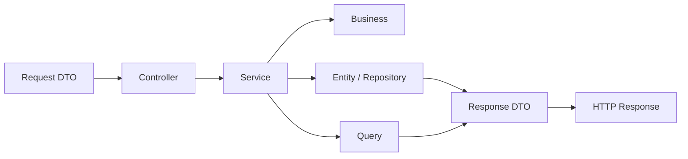

# M3L for Spring Boot

Implementação do padrão **M3L — Modular in 3 Layers** para aplicações backend com **Spring Boot**.

O M3L organiza a aplicação por **módulos de negócio**, e cada módulo é dividido em **três camadas principais**: `Http`, `Domain` e `Infrastructure`. O objetivo é construir backends mais claros, coesos, previsíveis e sustentáveis, usando Spring Boot com disciplina arquitetural.

---

## Sumário

- [Visão geral](#visão-geral)
- [Princípio central](#princípio-central)
- [Estrutura base](#estrutura-base)
- [Fluxo arquitetural](#fluxo-arquitetural)
- [Responsabilidades por camada](#responsabilidades-por-camada)
- [Exemplo prático](#exemplo-prático)
- [Consultas cross-module](#consultas-cross-module)
- [Convenções obrigatórias](#convenções-obrigatórias)
- [Checklist mental](#checklist-mental)
- [Pode / não deve ser padrão](#pode--não-deve-ser-padrão)
- [Extensibilidade controlada](#extensibilidade-controlada)
- [Objetivo deste repositório](#objetivo-deste-repositório)
- [Licença](#licença)

---

## Visão geral

O M3L não é apenas uma forma de organizar pacotes. Ele define um modo disciplinado de usar o Spring Boot sem deixar que a conveniência do framework dilua a clareza da arquitetura.

Neste padrão, o projeto é organizado por **contextos funcionais**, e não por depósitos técnicos globais como `controller`, `service`, `repository` e `entity` espalhados na raiz da aplicação.

> A lógica é simples: o módulo é a unidade principal de organização; as camadas existem dentro dele para separar responsabilidades.

No ecossistema Spring Boot, isso significa aproveitar o que a stack oferece de melhor — aplicações stand-alone, auto-configuração, starter dependencies e abstrações de persistência — sem deixar que tudo vire um grande acoplamento anotado. Arquitetura boa não é a que tem mais `@Something`; é a que ainda faz sentido seis meses depois.

---

## Princípio central

> **Módulo primeiro, camada depois.**

O fluxo arquitetural do M3L pode ser resumido assim:

- **Controllers recebem**
- **Services orquestram**
- **Business decide**
- **Entities persistem**
- **Repositories sustentam a persistência canônica**
- **Queries leem e cruzam dados**

Esse princípio reduz acoplamento, melhora a leitura do código e dificulta que o projeto se transforme em um amontoado de classes “sem dono”.

---

## Estrutura base

```txt
src/main/java/com/m3l/modules/
  companies/
    http/
      controllers/
      requests/
      responses/
    domain/
      services/
      business/
      enums/
    infrastructure/
      entities/
      repositories/
      queries/
```

Cada módulo concentra sua entrada HTTP, sua orquestração, sua regra de negócio, sua persistência canônica e suas consultas de leitura.

### Leitura rápida da estrutura

| Camada | Papel |
|---|---|
| `http` | Entrada e saída da aplicação |
| `domain` | Orquestração e regra de negócio |
| `infrastructure` | Persistência e consultas |

### Observação importante sobre adaptação ao Spring Boot

No Laravel, a persistência canônica aparece de forma mais direta em `Models`. No Spring Boot, essa responsabilidade naturalmente se materializa como **`Entity` + `Repository`**. O M3L permanece o mesmo; a tradução para a stack é que muda.

Da mesma forma, o equivalente dos `Resources` do Laravel costuma aparecer aqui como **response DTOs**, organizados em `http/responses`.

---

## Fluxo arquitetural



### Resumo do fluxo

**Request DTO -> Controller -> Service -> Business -> Entity / Repository / Query -> Response DTO**

- **Request DTO** valida a entrada
- **Controller** recebe e delega
- **Service** orquestra o caso de uso
- **Business** concentra regra pura
- **Entity** representa o estado persistido
- **Repository** sustenta a persistência canônica do agregado
- **Query** resolve leitura, filtros, projeções e joins
- **Response DTO** transforma a saída HTTP

---

## Responsabilidades por camada

### Http

Responsável pela entrada e saída da aplicação.

| Elemento | Responsabilidade | Pode usar | Não deve fazer |
|---|---|---|---|
| `Controllers` | Receber a requisição e delegar o caso de uso | `@RestController`, `@RequestMapping`, `ResponseEntity`, injeção de dependência | Regra de negócio, consulta complexa, escrita direta em `Repository` |
| `Requests` | Validar e representar a entrada HTTP | `record`, Bean Validation, `@Valid`, anotações como `@NotBlank` | Regra de negócio, persistência, consulta pesada |
| `Responses` | Representar a saída HTTP | response DTOs, `record`, mapeamento de resposta | Consultar banco, decidir regra, mutar estado |

### Domain

Responsável pela orquestração e pelas regras de negócio.

| Elemento | Responsabilidade | Pode usar | Não deve fazer |
|---|---|---|---|
| `Services` | Orquestrar o caso de uso | `@Service`, `@Transactional`, `Business`, `Repositories`, `Queries` | Virar classe gigante com toda a regra do sistema |
| `Business` | Concentrar regra pura do domínio | Java puro, enums, objetos neutros, cálculos, validações conceituais | Conhecer `Entity`, `Repository`, `Controller`, `Query` ou outro `Business` |
| `Enums` | Representar estados controlados | `enum` nativo do Java | Espalhar strings mágicas pelo sistema |

### Infrastructure

Responsável pela persistência e pelas consultas.

| Elemento | Responsabilidade | Pode usar | Não deve fazer |
|---|---|---|---|
| `Entities` | Representar a persistência canônica do módulo | JPA, `@Entity`, mapeamentos, constraints estruturais | Concentrar fluxo de negócio |
| `Repositories` | Sustentar a persistência canônica e consultas simples do agregado | Spring Data JPA, métodos derivados, persistência do agregado | Virar orquestrador de caso de uso ou motor de regra |
| `Queries` | Resolver leitura, filtros, projeções, relatórios e joins | `JdbcTemplate`, `NamedParameterJdbcTemplate`, `EntityManager`, projections, Querydsl | Escrita transacional e decisão de regra |

---

## Exemplo prático

### Estrutura do módulo `Companies`

```txt
src/main/java/com/m3l/modules/companies/
  http/
    controllers/
      CompanySaveController.java
    requests/
      CompanySaveRequest.java
    responses/
      CompanyResponse.java
  domain/
    services/
      CompanySaveService.java
    business/
      CompanyValidationBusiness.java
    enums/
      CompanyStatus.java
  infrastructure/
    entities/
      CompanyEntity.java
    repositories/
      CompanyRepository.java
    queries/
      CompanyListQuery.java
```

### Exemplo completo do módulo

<details>
<summary><strong>CompanySaveController.java</strong></summary>

```java
package com.m3l.modules.companies.http.controllers;

import com.m3l.modules.companies.domain.services.CompanySaveService;
import com.m3l.modules.companies.http.requests.CompanySaveRequest;
import com.m3l.modules.companies.http.responses.CompanyResponse;
import jakarta.validation.Valid;
import org.springframework.http.ResponseEntity;
import org.springframework.web.bind.annotation.PostMapping;
import org.springframework.web.bind.annotation.RequestBody;
import org.springframework.web.bind.annotation.RequestMapping;
import org.springframework.web.bind.annotation.RestController;

@RestController
@RequestMapping("/api/companies")
public class CompanySaveController {

    private final CompanySaveService service;

    public CompanySaveController(CompanySaveService service) {
        this.service = service;
    }

    @PostMapping
    public ResponseEntity<CompanyResponse> handle(@Valid @RequestBody CompanySaveRequest request) {
        var company = service.handle(request);
        return ResponseEntity.ok(CompanyResponse.from(company));
    }
}
```

</details>

<details>
<summary><strong>CompanySaveRequest.java</strong></summary>

```java
package com.m3l.modules.companies.http.requests;

import jakarta.validation.constraints.NotBlank;
import jakarta.validation.constraints.Size;

public record CompanySaveRequest(
    @NotBlank
    @Size(max = 255)
    String name,

    @NotBlank
    @Size(max = 20)
    String document,

    @NotBlank
    @Size(max = 50)
    String type
) {}
```

</details>

<details>
<summary><strong>CompanyResponse.java</strong></summary>

```java
package com.m3l.modules.companies.http.responses;

import com.m3l.modules.companies.infrastructure.entities.CompanyEntity;

import java.util.UUID;

public record CompanyResponse(
    Long id,
    UUID uuid,
    String name,
    String document,
    String type,
    String status
) {
    public static CompanyResponse from(CompanyEntity entity) {
        return new CompanyResponse(
            entity.getId(),
            entity.getUuid(),
            entity.getName(),
            entity.getDocument(),
            entity.getType(),
            entity.getStatus().name().toLowerCase()
        );
    }
}
```

</details>

<details>
<summary><strong>CompanySaveService.java</strong></summary>

```java
package com.m3l.modules.companies.domain.services;

import com.m3l.modules.companies.domain.business.CompanyValidationBusiness;
import com.m3l.modules.companies.domain.enums.CompanyStatus;
import com.m3l.modules.companies.http.requests.CompanySaveRequest;
import com.m3l.modules.companies.infrastructure.entities.CompanyEntity;
import com.m3l.modules.companies.infrastructure.repositories.CompanyRepository;
import org.springframework.stereotype.Service;
import org.springframework.transaction.annotation.Transactional;

import java.util.UUID;

@Service
public class CompanySaveService {

    private final CompanyValidationBusiness validationBusiness;
    private final CompanyRepository repository;

    public CompanySaveService(
        CompanyValidationBusiness validationBusiness,
        CompanyRepository repository
    ) {
        this.validationBusiness = validationBusiness;
        this.repository = repository;
    }

    @Transactional
    public CompanyEntity handle(CompanySaveRequest request) {
        validationBusiness.validateForSave(request.document(), request.type());

        var entity = new CompanyEntity();
        entity.setUuid(UUID.randomUUID());
        entity.setName(request.name());
        entity.setDocument(request.document());
        entity.setType(request.type());
        entity.setStatus(CompanyStatus.PENDING);

        return repository.save(entity);
    }
}
```

</details>

<details>
<summary><strong>CompanyValidationBusiness.java</strong></summary>

```java
package com.m3l.modules.companies.domain.business;

import java.util.Set;

public class CompanyValidationBusiness {

    private static final Set<String> ALLOWED_TYPES = Set.of(
        "generator",
        "operator",
        "manager",
        "manufacturer"
    );

    public void validateForSave(String document, String type) {
        if (document == null || document.isBlank()) {
            throw new IllegalArgumentException("Company document is required.");
        }

        if (!ALLOWED_TYPES.contains(type)) {
            throw new IllegalArgumentException("Invalid company type.");
        }
    }
}
```

</details>

<details>
<summary><strong>CompanyStatus.java</strong></summary>

```java
package com.m3l.modules.companies.domain.enums;

public enum CompanyStatus {
    PENDING,
    APPROVED,
    REJECTED
}
```

</details>

<details>
<summary><strong>CompanyEntity.java</strong></summary>

```java
package com.m3l.modules.companies.infrastructure.entities;

import com.m3l.modules.companies.domain.enums.CompanyStatus;
import jakarta.persistence.Column;
import jakarta.persistence.Entity;
import jakarta.persistence.EnumType;
import jakarta.persistence.Enumerated;
import jakarta.persistence.GeneratedValue;
import jakarta.persistence.GenerationType;
import jakarta.persistence.Id;
import jakarta.persistence.Table;

import java.util.UUID;

@Entity
@Table(name = "companies")
public class CompanyEntity {

    @Id
    @GeneratedValue(strategy = GenerationType.IDENTITY)
    private Long id;

    @Column(nullable = false, unique = true)
    private UUID uuid;

    @Column(nullable = false, length = 255)
    private String name;

    @Column(nullable = false, length = 20)
    private String document;

    @Column(nullable = false, length = 50)
    private String type;

    @Enumerated(EnumType.STRING)
    @Column(nullable = false, length = 20)
    private CompanyStatus status;

    public Long getId() {
        return id;
    }

    public UUID getUuid() {
        return uuid;
    }

    public void setUuid(UUID uuid) {
        this.uuid = uuid;
    }

    public String getName() {
        return name;
    }

    public void setName(String name) {
        this.name = name;
    }

    public String getDocument() {
        return document;
    }

    public void setDocument(String document) {
        this.document = document;
    }

    public String getType() {
        return type;
    }

    public void setType(String type) {
        this.type = type;
    }

    public CompanyStatus getStatus() {
        return status;
    }

    public void setStatus(CompanyStatus status) {
        this.status = status;
    }
}
```

</details>

<details>
<summary><strong>CompanyRepository.java</strong></summary>

```java
package com.m3l.modules.companies.infrastructure.repositories;

import com.m3l.modules.companies.infrastructure.entities.CompanyEntity;
import org.springframework.data.jpa.repository.JpaRepository;

public interface CompanyRepository extends JpaRepository<CompanyEntity, Long> {
    boolean existsByDocumentAndType(String document, String type);
}
```

</details>

<details>
<summary><strong>CompanyListQuery.java</strong></summary>

```java
package com.m3l.modules.companies.infrastructure.queries;

import org.springframework.jdbc.core.namedparam.MapSqlParameterSource;
import org.springframework.jdbc.core.namedparam.NamedParameterJdbcTemplate;
import org.springframework.stereotype.Repository;

import java.util.List;

@Repository
public class CompanyListQuery {

    private final NamedParameterJdbcTemplate jdbc;

    public CompanyListQuery(NamedParameterJdbcTemplate jdbc) {
        this.jdbc = jdbc;
    }

    public List<CompanyListItem> handle(String status, String name) {
        var sql = new StringBuilder("""
            select
                c.id,
                c.uuid,
                c.name,
                c.document,
                c.type,
                c.status
            from companies c
            where 1 = 1
        """);

        var params = new MapSqlParameterSource();

        if (status != null && !status.isBlank()) {
            sql.append(" and c.status = :status");
            params.addValue("status", status);
        }

        if (name != null && !name.isBlank()) {
            sql.append(" and c.name like :name");
            params.addValue("name", "%" + name + "%");
        }

        sql.append(" order by c.name");

        return jdbc.query(sql.toString(), params, (rs, rowNum) -> new CompanyListItem(
            rs.getLong("id"),
            rs.getString("uuid"),
            rs.getString("name"),
            rs.getString("document"),
            rs.getString("type"),
            rs.getString("status")
        ));
    }

    public record CompanyListItem(
        Long id,
        String uuid,
        String name,
        String document,
        String type,
        String status
    ) {}
}
```

</details>

Os exemplos acima refletem o uso recomendado do padrão no Spring Boot: controller magro, service orientado a ação, business puro, entity e repository canônicos para persistência e query dedicada à leitura.

---

## Consultas cross-module

No M3L, leituras cruzadas entre módulos devem ser resolvidas por **`Queries`**, e não por acoplamento estrutural via navegação indiscriminada de entidades como estratégia principal. A `Entity` continua pertencendo ao módulo dono; o join pertence à `Query`.

Exemplo:

```java
package com.m3l.modules.documents.infrastructure.queries;

import org.springframework.jdbc.core.namedparam.NamedParameterJdbcTemplate;
import org.springframework.stereotype.Repository;

import java.util.List;
import java.util.Map;

@Repository
public class DocumentWithCompanyListQuery {

    private final NamedParameterJdbcTemplate jdbc;

    public DocumentWithCompanyListQuery(NamedParameterJdbcTemplate jdbc) {
        this.jdbc = jdbc;
    }

    public List<DocumentWithCompanyItem> handle(String status) {
        var sql = """
            select
                d.id,
                d.uuid,
                d.type,
                d.number,
                d.status,
                c.id   as company_id,
                c.name as company_name
            from documents d
            join companies c on c.id = d.company_id
            where (:status is null or d.status = :status)
            order by d.id desc
        """;

        return jdbc.query(sql, Map.of("status", status), (rs, rowNum) -> new DocumentWithCompanyItem(
            rs.getLong("id"),
            rs.getString("uuid"),
            rs.getString("type"),
            rs.getString("number"),
            rs.getString("status"),
            rs.getLong("company_id"),
            rs.getString("company_name")
        ));
    }

    public record DocumentWithCompanyItem(
        Long id,
        String uuid,
        String type,
        String number,
        String status,
        Long companyId,
        String companyName
    ) {}
}
```

---

## Convenções obrigatórias

- **Controllers**: orientados a uma ação
- **Services**: um único método público chamado `handle()`
- **Business**: não conhece `Entity`, `Repository`, `Query` ou outro `Business`
- **Entities**: entidade canônica do módulo dono
- **Repositories**: persistência canônica e consultas simples do agregado
- **Queries**: leitura, filtros, projeções, relatórios e joins

---

## Checklist mental

- Isso é entrada HTTP? Vai em `http`
- Isso orquestra um caso de uso? Vai em `domain/services`
- Isso é regra pura? Vai em `domain/business`
- Isso representa estado controlado? Vai em `domain/enums`
- Isso é persistência canônica do módulo? Vai em `infrastructure/entities` e `infrastructure/repositories`
- Isso é leitura, filtro, projeção, relatório ou join? Vai em `infrastructure/queries`

---

## Pode / não deve ser padrão

### Pode

- Service chamar Business, usar Repository e abrir transação
- Request DTO validar formato e obrigatoriedade do payload
- Response DTO transformar a saída HTTP
- Query fazer filtro, projeção, relatório e join
- Enum representar status, tipo e categoria

### Não deve ser padrão

- Controller usar Repository direto ou concentrar regra de negócio
- Business acessar banco, conhecer Query ou outro Business
- Entity virar objeto com lógica de fluxo da aplicação
- Repository virar um centro de orquestração de caso de uso
- Navegação entre entidades de módulos diferentes virar estratégia arquitetural principal
- Service virar arquivo gigante com tudo dentro

---

## Extensibilidade controlada

O M3L permite subdiretórios adicionais dentro das camadas quando houver necessidade técnica real e justificável, como:

- `mappers`
- `factories`
- `validators`
- `integrations`
- `clients`

Esses diretórios não devem virar pasta genérica de código “sem lugar”. Devem existir para resolver responsabilidades claras e recorrentes.

Quando um módulo depender de serviços externos específicos do seu próprio contexto, a integração deve permanecer dentro do próprio módulo, em `infrastructure/integrations`.

Exemplo:

```txt
src/main/java/com/m3l/modules/documents/infrastructure/integrations/
  AzureDocumentIntelligenceClient.java
  OpenAiDocumentAnalysisClient.java
```

Esse tipo de organização evita granularização prematura e mantém a integração próxima do domínio que a utiliza.

---

## Objetivo deste repositório

Este repositório existe para documentar e exemplificar a aplicação do padrão M3L no ecossistema Spring Boot, servindo como referência para:

- arquitetura de novos projetos
- padronização de times
- onboarding técnico
- revisão de código
- construção de backends modulares e sustentáveis

---

## Licença

Esta documentação está sob a licença
[Creative Commons Attribution 4.0 International License (CC BY 4.0)](https://creativecommons.org/licenses/by/4.0/).
